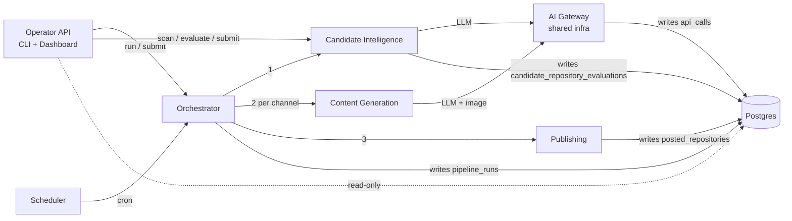
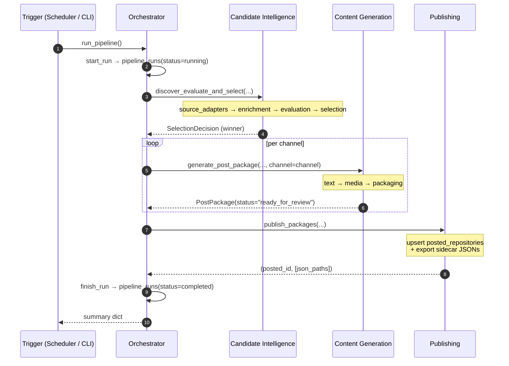

# RepoRadar Services

One doc per microservice. Each follows the same structure: purpose, source layout, internal pipeline, entry points, how it works, data ownership, cross-service interactions, state machine, configuration knobs, failure modes, and what's out of scope.

For the system-level picture and broader rationale, see [reporadar_v2_architecture.md](../reporadar_v2_architecture.md) and [reporadar_database_design.md](../reporadar_database_design.md).

## Services

| Service | Doc | One-liner |
|---|---|---|
| **Candidate Intelligence** | [candidate_intelligence.md](candidate_intelligence.md) | "What should we post next?" — discovery + enrichment + evaluation + selection |
| **Content Generation** | [content_generation.md](content_generation.md) | "Build the platform-ready post." — text + media + packaging |
| **Publishing** | [publishing.md](publishing.md) | "Make the post real, then make it copy-pasteable." — posted_repositories + sidecar exports |
| **Orchestrator** | [orchestrator.md](orchestrator.md) | "Coordinate the run. Do nothing else." — workflow only, three service calls per run |
| **Scheduler** | [scheduler.md](scheduler.md) | "Fire the daily run. Don't think about what the run does." — APScheduler daemon |
| **Operator API** | [operator_api.md](operator_api.md) | "The human's interface to the whole system." — CLI + read-only dashboard |

## High-level service map

## Per-service data ownership

| Service | Owns (writes) | Reads cross-service |
|---|---|---|
| Candidate Intelligence | `candidate_repository_evaluations` (entire table) | `posted_repositories.canonical_repo_key` (dedup) |
| Content Generation | nothing in DB; writes JPEGs to `output/` | `candidate_repository_evaluations` via rehydration helpers |
| Publishing | `posted_repositories` (entire table), `post_link` JSONB on candidate rows | `candidate_repository_evaluations` (the winner) |
| Orchestrator | `pipeline_runs` | — |
| Scheduler | nothing | — |
| Operator API | `pipeline_runs` (its CLI commands) | denormalized read via `web/queries.py` |
| AI Gateway (infra) | `api_calls` | — |

Each table has exactly one writing service. Cross-service reads happen through the dashboard's read-model module or narrow, explicit utility queries (e.g. `already_posted_keys`).

## Stage flow in one pipeline run

## Shared infrastructure (not services)

These three modules are used by every service but are not microservices themselves:

| Module | What it provides |
|---|---|
| `src/common/` | `Settings.from_env()`, `connect()` (psycopg), `log_api_call`, `get_logger`, ID generators (`run_id`, `candidate_id`, `project_id_for`, ...) |
| `src/contracts/` | Frozen Pydantic models flowing between services: `Candidate`, `Evaluation`, `SelectionDecision`, `GeneratedContent`, `MediaAsset`, `PostPackage`, `PipelineRun` |
| `src/ai_gateway/` | Provider adapters for LLMs (Claude / Gemini / OpenAI) + image generation (OpenAI). Centralized observability via `api_calls` |

## How to read these docs

Pick the service you're working on. Each doc is **self-contained** — you should not need to read the others to understand one. Cross-references are explicit when they matter.

If you're new to RepoRadar, read in this order:

1. [reporadar_v2_architecture.md](../reporadar_v2_architecture.md) — system rationale
2. [reporadar_database_design.md](../reporadar_database_design.md) — data model
3. [orchestrator.md](orchestrator.md) — see how the services compose
4. [candidate_intelligence.md](candidate_intelligence.md), [content_generation.md](content_generation.md), [publishing.md](publishing.md) — the three business services in pipeline order
5. [scheduler.md](scheduler.md), [operator_api.md](operator_api.md) — entry points

## How to add a new service

1. Add `src/<service_name>/` with at least `__init__.py` and `service.py` (top-level entry).
2. Add a `repository.py` if it owns its own DB table — write a `migrations/<n>_*.sql` for the schema.
3. Wire it into the orchestrator or operator_api CLI.
4. Add `Doc/services/<service_name>.md` following the same structure as the existing docs.
5. Update this README's tables.

## How to add a new channel (Instagram-style)

That's not a new service — it's three files inside Content Generation. See [content_generation.md → "Adding a new channel"](content_generation.md).
