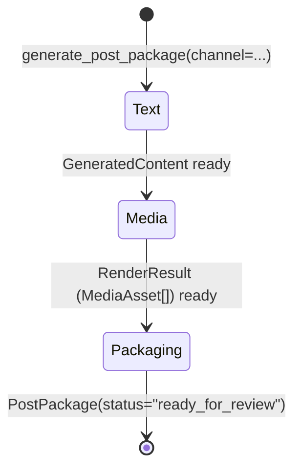
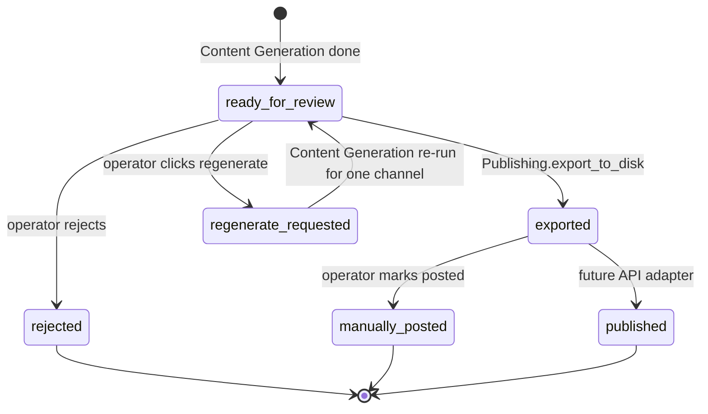

# Content Generation

> *"Build the platform-ready post."*

## Purpose

Content Generation takes one selected candidate + its evaluation, and produces a `PostPackage` per requested channel — text, image asset, source links, alt text, and channel-specific validation results — ready for the operator to review and publish.

Every output of this service is in-memory or on local disk. Nothing is written to the database here; Publishing owns the persistence step.

## Source layout

The service has three internal stages that run in sequence. Each stage has the same shape: `service.py` (stage entry) + `channels/` directory (per-channel implementations).

```
src/content_generation/
├── __init__.py
├── service.py                              # Top-level: generate_post_package
│
├── text/                                   # Stage 1 — per-channel text
│   ├── service.py                          #   generate_text dispatcher
│   └── channels/
│       ├── instagram.py                    #   generate_instagram_caption
│       └── linkedin.py                     #   generate_linkedin_commentary
│
├── media/                                  # Stage 2 — per-channel image
│   ├── service.py                          #   render_media
│   ├── profile.py                          #   ChannelMediaProfile dataclass
│   ├── style.py                            #   BASE_STYLE + motifs + helpers
│   └── channels/
│       ├── __init__.py                     #   PROFILES dict + get_profile
│       ├── instagram.py                    #   INSTAGRAM_PROFILE + prompt builder
│       └── linkedin.py                     #   LINKEDIN_PROFILE + prompt builder
│
└── packaging/                              # Stage 3 — assembly + validation
    ├── service.py                          #   build_post_package
    └── channels/
        ├── __init__.py                     #   VALIDATORS dict + dispatcher
        ├── instagram.py                    #   validate_instagram_package
        └── linkedin.py                     #   validate_linkedin_package
```

The three stages map cleanly to the three things a post needs: *what it says* (text), *what it shows* (media), and *the bundle the operator sees* (package).

## Internal pipeline



For one call to `generate_post_package`, exactly one channel is processed. The orchestrator loops over channels and calls this function once per channel, so failures in one channel never block another.

## Entry points

```python
from src.content_generation import (
    generate_post_package,    # all three stages
    generate_text,            # stage 1 only
    render_media,             # stage 2 only
    build_post_package,       # stage 3 only
)
```

| Function | Signature (abridged) | Returns |
|---|---|---|
| `generate_post_package` | `(conn, settings, run_id, candidate, evaluation, provider, *, channel)` | `PostPackage` |
| `generate_text` | `(candidate, evaluation, provider, *, channel)` | `GeneratedContent` |
| `render_media` | `(conn, settings, run_id, candidate, evaluation, content, *, channel)` | `RenderResult` |
| `build_post_package` | `(candidate, content, media, *, run_id, channel)` | `PostPackage` |

Individual stages are exposed so that a *regenerate image only* flow can call `render_media` without re-running text generation, etc.

## How each stage works

### Stage 1 — Text (`text/`)

`text/service.py::generate_text(candidate, evaluation, provider, *, channel)` is a simple dispatcher:

```python
if channel == "instagram":
    return generate_instagram_caption(candidate, evaluation, provider)
if channel == "linkedin":
    return generate_linkedin_commentary(candidate, evaluation, provider)
raise NotImplementedError(...)
```

**Instagram caption (`channels/instagram.py`):** asks the LLM for `{hook, body, cta, hashtags}` as JSON. Two variants — repo prompt vs hackathon prompt — driven by whether the candidate has `github` or `hackathon` populated. On JSON-parse failure, retries once with a stricter prompt. Renders the final text by concatenating hook/body/cta/hashtags/source-links, clipped to Instagram's 2200-char limit.

**LinkedIn commentary (`channels/linkedin.py`):** asks the LLM for free-form post text (no JSON). System prompt enforces structure (open with surprise, explain what + how, caveat if thin, end with question + follow CTA), 900–1800 chars, 3–5 hashtags, no invented benchmarks. Currently only supports GitHub candidates — hackathon → LinkedIn is not wired and raises `ValueError`.

Both return a `GeneratedContent` contract:

```python
GeneratedContent(
    channel: "instagram" | "linkedin",
    content_format: "caption" | "commentary",
    text: str,
    hook / body / cta / hashtags / source_links,
    character_count, generated_at, model, prompt_version,
)
```

### Stage 2 — Media (`media/`)

`media/service.py::render_media(...)` does the following:
1. Look up the `ChannelMediaProfile` for the channel via `media/channels/get_profile(channel)`.
2. Ensure `settings.output_dir` exists.
3. Build an `OpenAIImageClient` sized to the profile (`1024x1024` for Instagram, `1024x1536` for LinkedIn) via the AI Gateway.
4. Call `profile.prompt_builder(candidate, evaluation, content)` to assemble a deterministic image prompt — uses the text stage's `hook` as the headline.
5. Generate the image, write JPEG to `output_dir`, return a `MediaAsset` containing the local path, dimensions, alt text, and prompt version.

**Why a profile dataclass instead of an if/else?** Adding a new channel means adding one file in `media/channels/` and one line in `PROFILES`. No service-level changes.

```python
@dataclass(frozen=True)
class ChannelMediaProfile:
    channel: str
    width: int
    height: int
    aspect_ratio: str
    openai_size: str
    image_prompt_version: str
    prompt_builder: Callable[[Candidate, Evaluation, GeneratedContent], str]
    style: str
```

**Per-channel prompt builders** (`media/channels/instagram.py`, `linkedin.py`):
- Both import the shared helpers from `media/style.py` (`BASE_STYLE`, `BRAND`, `headline_from_content`, `imagery_for_repo`, `imagery_for_hackathon`, `short_summary`).
- Instagram is square (1:1); has both repo and hackathon variants.
- LinkedIn is tall (2:3); has a stats band at the bottom showing `+N STARS · +X% GROWTH`; repo-only today.

**Image binaries never live in the DB.** The JPEG goes to `output/<channel>_<stem>_<timestamp>.jpg`; the database row in `posted_repositories` stores only the path + metadata.

### Stage 3 — Packaging (`packaging/`)

`packaging/service.py::build_post_package(...)`:
1. Look up the per-channel validator via `packaging/channels/validators_for(channel)`. Unknown channels get a no-op validator.
2. Run validation — produces a list of human-readable issues. Logged as warnings; not blocking.
3. Collect source links from the candidate (GitHub URL, Devpost URL, demo URL).
4. Build a `PostPackage` with `status="ready_for_review"`, `post_id = post_<channel>_<uuid8>`, validation warnings stored in `review_notes`.

**Validators (`channels/instagram.py`, `linkedin.py`):**
- Instagram: caption ≤2200 chars, ≥1 media asset, 3–8 hashtags.
- LinkedIn: 600–3000 chars (warns if outside 900–1800), ≥1 media asset, alt text required on every asset.

Validation is advisory — issues are surfaced for the operator but do not stop the package from being created. This is intentional: a slightly-too-short LinkedIn post should still reach review.

## Data ownership

Content Generation owns **no database tables**. Its outputs flow through the call chain as in-memory objects (`GeneratedContent`, `MediaAsset`, `PostPackage`) and only become persistent when Publishing writes them into `posted_repositories.post_instances[]`.

The only on-disk artifact this service produces directly is the JPEG file (Stage 2). Publishing writes a JSON sidecar later, but the image is this service's responsibility.

## How other services interact

| Caller | What it calls | Why |
|---|---|---|
| `orchestrator.pipeline.run_pipeline` | `generate_post_package` (once per channel) | Full daily pipeline |
| Future regenerate flows | `generate_text` / `render_media` independently | "Operator clicked regenerate caption only" |

Nothing reads from Content Generation — it's strictly call-forward, return-an-object.

## Adding a new channel

Adding e.g. a `newsletter` channel requires three files (one per stage) plus two registrations:

1. **Text:** `text/channels/newsletter.py` with `generate_newsletter_blurb(candidate, evaluation, provider) -> GeneratedContent`. Add a branch in `text/service.py`.
2. **Media:** `media/channels/newsletter.py` with a prompt builder + `NEWSLETTER_PROFILE = ChannelMediaProfile(...)`. Add to `PROFILES` in `media/channels/__init__.py`.
3. **Packaging:** `packaging/channels/newsletter.py` with `validate_newsletter_package`. Add to `VALIDATORS` in `packaging/channels/__init__.py`.

The orchestrator does not need to change — it just calls `generate_post_package(channel="newsletter")`.

## PostPackage state machine

`PostPackage.status` starts at `ready_for_review` when Content Generation hands off. Subsequent transitions are owned by Publishing:



## Failure modes

- **One channel's text generation fails:** propagates from `generate_text` as `ValueError` / `NotImplementedError`. The orchestrator catches this per-channel — other channels still proceed.
- **Image generation fails:** `OpenAIImageClient.generate` re-raises; caught at orchestrator level.
- **Validation warnings:** never block. They appear in `review_notes` and surface in the dashboard.
- **LinkedIn + hackathon candidate:** explicitly rejected in `text/channels/linkedin.py` with a clear `ValueError`. The orchestrator should not have selected a hackathon for LinkedIn-only output anyway.

## Configuration knobs

From `Settings`:

| Setting | Default | Effect |
|---|---|---|
| `output_dir` | `output/` | Where JPEGs are written |
| `openai_api_key` | (required) | Image generation; also LLM if `llm_provider=openai` |
| `llm_provider` | `openai` | Text generation backend (`claude` / `gemini` / `openai`) |

## Out of scope today

- **Carousel / multi-slide rendering.** `MediaAsset.asset_type` allows `carousel_slide` but no channel currently emits multiple slides.
- **Alt-text generated by the LLM.** Today alt text is templated from `evaluation.summary` in `media/service._alt_text_for`.
- **Per-channel A/B prompts.** `prompt_version` is recorded but there's no router.
- **Newsletter, X, website channels.** All scaffolded in `contracts.Channel` but unimplemented.
- **Object storage for images.** Images live in `output/` on the local filesystem; v2 §3.1 anticipates S3/MinIO/R2 — when added, `MediaAsset.uri` will hold the S3 URI alongside `local_path`.
