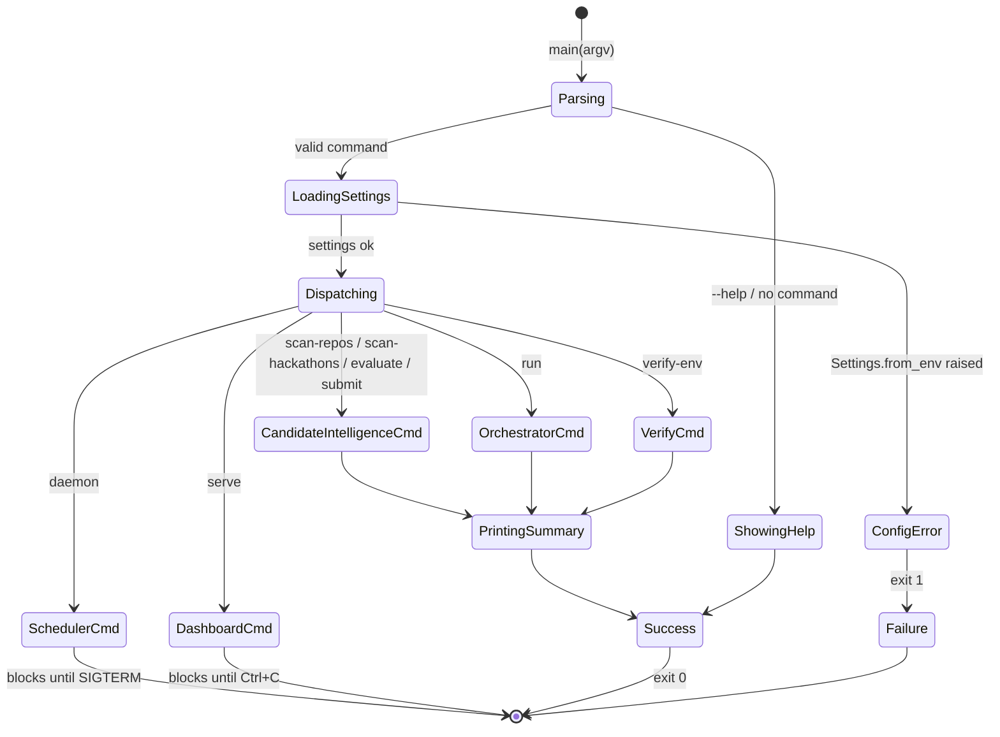
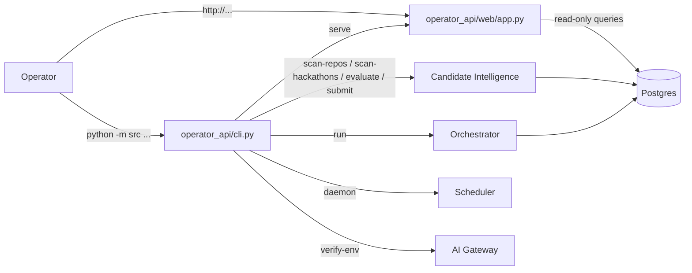
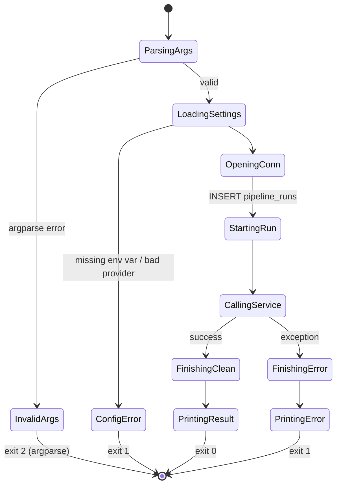

# Operator API

> *"The human's interface to the whole system."*

## Purpose

Operator API is the control plane — every way a human interacts with RepoRadar lives here. Today that means:

- A **CLI** (`python -m src <command>`) for running scans, evaluating, kicking off the full pipeline, manually submitting URLs, smoke-testing the environment, and starting the daemon or dashboard.
- A **read-only Flask dashboard** (`python -m src serve`) showing posts awaiting review, recent evaluations, today's scans, hackathon candidates, and recent runs.

Per v2 §2.1 this service is a true control plane: it never does the work itself, it just calls into the other services and reads from a denormalized view of their tables. The dashboard's eventual approve/reject/regenerate buttons (v2 §9) will plug in here without other services changing.

## Source layout

```
src/operator_api/
├── __init__.py
├── cli.py                          # argparse + command handlers
└── web/
    ├── __init__.py
    ├── app.py                      # Flask factory + routes
    ├── queries.py                  # all dashboard SQL — the read model
    ├── templates/
    │   └── dashboard.html          # single-page HTML
    └── static/
        └── style.css
```

`cli.py` and `web/` are the two surfaces. They share `Settings` and the Postgres connection layer, but they don't depend on each other.

## CLI surface

`python -m src` dispatches to one of these commands. The mapping is in `cli.main()`:

| Command | Handler | What it does |
|---|---|---|
| `scan-repos` | `cmd_scan_repos` | Run `source_adapters.github_discovery.scan_github` and print the table of new repos |
| `scan-hackathons` | `cmd_scan_hackathons` | Run `source_adapters.devpost_discovery.scan_devpost` |
| `evaluate` | `cmd_evaluate` | Run `candidate_intelligence.evaluate_pending_candidates` — score any unevaluated rows |
| `run` | `cmd_run` | Run the full pipeline via `orchestrator.run_pipeline` |
| `submit <url> [--channels=...]` | `cmd_submit` | Manual URL → enriched candidate → synthesized evaluation (no LLM scoring) → forced selection → Content Generation → Publishing, in one shot. Produces a ready-for-review post immediately, no LLM gate. |
| `serve` | `cmd_serve` | Start the Flask dashboard |
| `daemon` | `cmd_daemon` | Start the APScheduler daemon (`scheduler.daemon.run_forever`) |
| `verify-env` | `cmd_verify_env` | Smoke-test GitHub, LLM, output dir, Postgres — exit 1 if any fail |

Every handler follows the same pattern:

```python
def cmd_xxx(args, settings):
    with connect(settings) as conn:
        run_id = start_run(conn, run_type="xxx")          # 1. orchestrator-style run row
        log = get_logger("reporadar.xxx", run_id)
        try:
            result = call_into_service(conn, settings, run_id, ...)
            finish_run(conn, run_id)                       # 2. mark completed
            # 3. print human-readable summary
            return 0
        except Exception as exc:
            finish_run(conn, run_id, error=str(exc))
            log.error("xxx failed: %s", exc)
            return 1
```

That structure means every CLI command shows up in the dashboard's "recent runs" list with a `run_type` you can filter on (`scan_repos`, `scan_hackathons`, `evaluate`, `manual_submission`, `verify_env`, `daemon`, plus `daily_discovery` from the scheduler).

### CLI workflow



## Dashboard surface

Single page at `/` rendering five sections, plus a `/media/<filename>` route for serving rendered images:

| Section | Source query |
|---|---|
| Posts awaiting review | `queries.get_recent_posts` — reads `posted_repositories.post_instances` (flattened by channel). Each row includes `first_path_basename` so the template can `` the rendered poster inline, plus the full caption, hashtags, source links, alt text, and any validation warnings. |
| Recent evaluations | `queries.get_recent_evaluations` — reads `candidate_repository_evaluations` where `evaluation IS NOT NULL` |
| Scanned repos today | `queries.get_todays_scans` — reads `candidate_repository_evaluations` where `source_type='github_discovery'` and `created_at::date = CURRENT_DATE` |
| Recent hackathon candidates | `queries.get_recent_hackathons` — same table, `source_type='devpost_discovery'` |
| Recent runs | `queries.get_recent_runs` — reads `pipeline_runs` |

The `/media/<path:filename>` route uses Flask's `send_from_directory(settings.output_dir, filename)`, which both serves the JPEG and refuses any `filename` that resolves outside the output dir (defense against path traversal).

`app.py` is intentionally tiny: a Flask factory, two routes (`/` and `/media/...`), one template global (`score_class` for color-coding scores). All the SQL lives in `queries.py`.

```python
@app.route("/")
def dashboard():
    conn = open_connection(settings)
    try:
        return render_template(
            "dashboard.html",
            scans=queries.get_todays_scans(conn),
            hackathons=queries.get_recent_hackathons(conn),
            evaluations=queries.get_recent_evaluations(conn),
            posts=queries.get_recent_posts(conn),
            runs=queries.get_recent_runs(conn),
            today=date.today().isoformat(),
        )
    finally:
        conn.close()
```

### Read-model isolation

`queries.py` is RepoRadar's denormalized read model. It is the **only** place in the codebase that reads across multiple JSONB sections of multiple service tables in a single query. The dashboard never imports a service's repository module directly.

Why this matters: when (not if) services move to separate processes / databases, the read-model layer is the easiest part to swap. Today it's `psycopg.connect()` against the same DB; tomorrow it could be a materialized view, an event-sourced projection, or per-service HTTP calls behind an aggregator.

### `verify-env` deep-dive

A useful pattern worth calling out: `verify-env` is the only command that exercises every external dependency *without* doing real work.

```
LLM_PROVIDER=openai
GitHub OK — 4987/5000 core requests remaining
LLM (openai) OK — sample: 'OK'
Output dir OK — /Users/.../reporadar/output
Postgres OK

All checks passed.
```

It catches each subsystem's failure independently so you get one report of everything wrong (not just the first failure). Issues are collected in a list; the command exits 1 if any failed.

## Data ownership

Operator API owns **nothing** in the database. It writes only `pipeline_runs` rows for its own CLI command invocations (using the shared `orchestrator.runs.start_run` / `finish_run`).

| Operation | Where it goes |
|---|---|
| Each CLI command's lifecycle | `pipeline_runs` (via orchestrator helpers) |
| All reads | `queries.py` against multiple service tables |

The dashboard reads from `posted_repositories`, `candidate_repository_evaluations`, and `pipeline_runs` — it never reads `api_calls`, the AI Gateway's table.

## Cross-service interactions



| From | Calls | Why |
|---|---|---|
| `cli.cmd_scan_repos` | `candidate_intelligence.source_adapters.github_discovery.scan_github` | CLI scan |
| `cli.cmd_scan_hackathons` | `candidate_intelligence.source_adapters.devpost_discovery.scan_devpost` | CLI scan |
| `cli.cmd_evaluate` | `candidate_intelligence.evaluate_pending_candidates` | Catch up evaluations |
| `cli.cmd_submit` | `manual_submission.submit_manual` → `enrich_github_candidate` → `synthesize_evaluation_for_manual` → forced `SelectionDecision` → `content_generation.generate_post_package` (per channel) → `publishing.publish_packages` | Operator URL paste produces a post directly — no LLM evaluation gate |
| `cli.cmd_run` | `orchestrator.run_pipeline` | Full daily pipeline manually |
| `cli.cmd_serve` | starts Flask app from `web.app.create_app` | Dashboard |
| `cli.cmd_daemon` | `scheduler.daemon.run_forever` | Long-running scheduler |
| `cli.cmd_verify_env` | `GithubClient`, `ai_gateway.get_llm_provider`, Postgres `SELECT 1` | Health checks |
| `web.app.dashboard` route | `web.queries.*` | Read-only dashboard rendering |

Nothing calls into Operator API. It is strictly an *initiating* and *displaying* service.

## State of one CLI command



## Configuration knobs

The Operator API doesn't have its own settings beyond what every service uses (`Settings.from_env()`). The dashboard's host/port/debug are CLI args:

```bash
python -m src serve --host 0.0.0.0 --port 8080 --debug
```

## Failure modes

| Symptom | Cause | Effect |
|---|---|---|
| `Configuration error: ...` to stderr | `Settings.from_env` raised (missing env var, bad LLM provider name, missing API key) | Exit 1 before any DB activity |
| CLI command raises mid-flight | Downstream service failure | `finish_run(error=...)` and exit 1; the dashboard shows the failed run with the error message |
| Dashboard query fails | Postgres unreachable, schema not applied | 500 error; visible in the Flask log; one bad section does not affect others (each is queried independently) |
| `serve` port in use | Another process on the port | Flask raises `OSError`; exit immediately |

## Future: approve / reject / regenerate

v2 §9 lays out the post-MVP workflow:

```http
POST /posts/{post_id}/approve
POST /posts/{post_id}/reject
POST /posts/{post_id}/regenerate
POST /posts/{post_id}/mark-posted
POST /projects/submit
POST /runs
```

These slot in cleanly:

- **`approve` / `reject`** → update `posted_repositories.post_instances[].status` (already supported by `publishing.repository.mark_manually_posted`'s pattern).
- **`regenerate`** → call `content_generation.generate_post_package` again for a specific channel; replace the matching `post_instance`.
- **`mark-posted`** → exactly `publishing.repository.mark_manually_posted`.
- **`projects/submit`** → exactly `manual_submission.submit_manual` (already CLI-exposed as `submit`).
- **`runs`** → exactly `orchestrator.run_pipeline` (already CLI-exposed as `run`).

Adding them means writing a few Flask route handlers in `web/app.py` (or a new `web/routes.py`). No other service changes.

## Out of scope today

- **Authentication.** Dashboard is open. Fine for local-only use; needs auth before any public exposure.
- **WebSockets / live updates.** The dashboard is request-response; refresh to see new data.
- **Per-user audit trail.** Every CLI run is `requested_by="manual"` or `"operator"` — no per-user identity.
- **Operator UI for approve/reject.** Listed above as the next likely addition; today's dashboard is read-only.
- **Pagination on dashboard tables.** Each section is hard-capped at 8–25 rows.
- **CSV / JSON export from the dashboard.** Sidecar JSONs in `output/` exist per-post; dashboard-level export does not.
