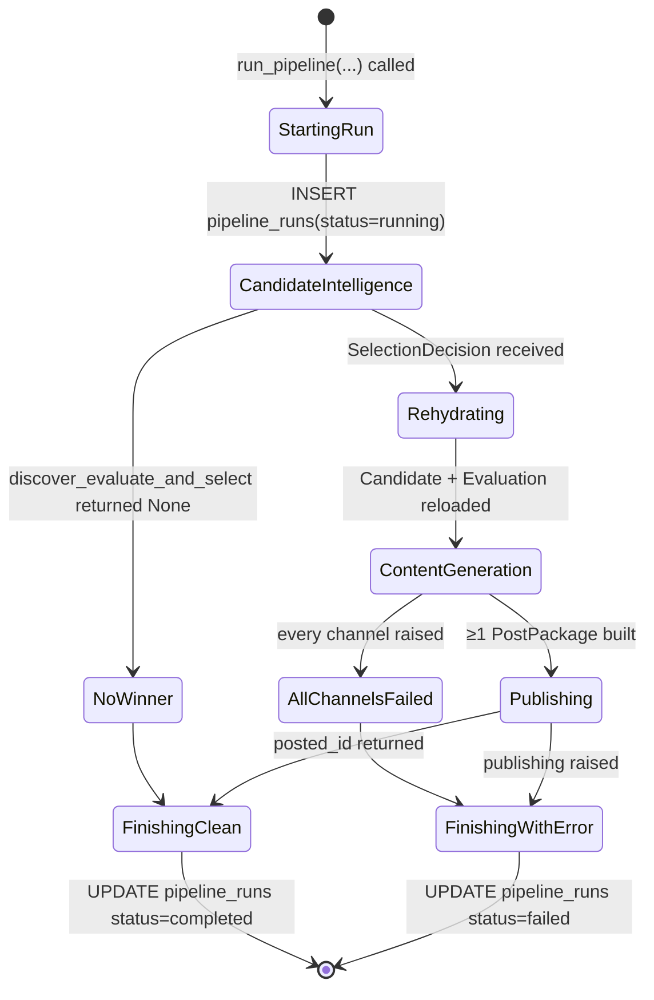
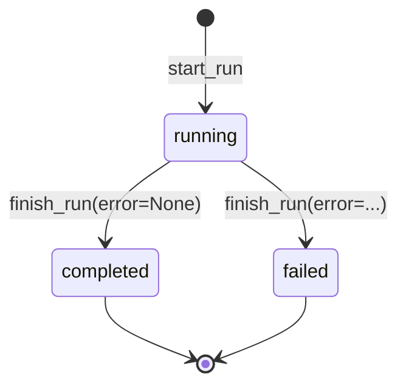

# Orchestrator

> *"Coordinate the run. Do nothing else."*

## Purpose

The Orchestrator is the brain that turns a single trigger ("a run was requested") into the full sequence of service calls that produce a reviewable post. It manages:

- The lifecycle of one `pipeline_runs` row (start → completed / failed).
- The order in which the three business services are called.
- Per-channel fan-out and isolation (one channel's failure does not kill the others).
- Rehydration of the winning Candidate + Evaluation from JSONB rows after Candidate Intelligence hands back only a `SelectionDecision`.

Per v2 §2.3 it contains **workflow logic only** — no prompt templates, no scoring, no scraping, no formatting. Anything that decides *what* the pipeline produces belongs in a downstream service.

## Source layout

```
src/orchestrator/
├── __init__.py
├── pipeline.py                   # run_pipeline + rehydration helpers
└── runs.py                       # start_run / finish_run — pipeline_runs CRUD
```

That's the entire service. ~120 lines total — by design.

## Workflow



`NoWinner` is a clean finish — "nothing eligible today" is a valid outcome, not an error.

## Entry point

```python
from src.orchestrator import run_pipeline

def run_pipeline(
    conn: psycopg.Connection,
    settings: Settings,
    *,
    channels: list[str] | None = None,
    requested_by: str = "manual",
) -> dict | None:
```

| Argument | Meaning |
|---|---|
| `conn` | An open psycopg Connection; the orchestrator does not open/close it |
| `settings` | Loaded `Settings` instance |
| `channels` | Override which channels to render for (default: `["instagram", "linkedin"]`) |
| `requested_by` | Audit field stored on the `pipeline_runs` row — `"scheduler"`, `"manual"`, or `"operator"` |

Returns a summary dict on success (or `None` when nothing was selected):

```python
{
    "run_id": "run_...",
    "posted_id": "posted_proj_...",
    "candidate_id": "cand_...",
    "project_id": "proj_...",
    "selection_score": 8.42,
    "channels": ["instagram", "linkedin"],
    "image_paths": ["output/instagram_x_...jpg", ...],
    "export_paths": ["output/instagram_post_...json", ...],
}
```

## How it works

The full body of `run_pipeline` is essentially three service calls separated by run-lifecycle bookkeeping:

```python
run_id = start_run(conn, requested_by=requested_by, config={"channels": channels or []})
try:
    provider = get_llm_provider(settings, conn, run_id)

    # 1. Candidate Intelligence
    selection = discover_evaluate_and_select(conn, settings, run_id, provider, channels=channels)
    if selection is None:
        finish_run(conn, run_id)
        return None

    candidate = _candidate_from_db(conn, selection.candidate_id, run_id)
    evaluation = _evaluation_from_db(conn, selection.candidate_id)

    # 2. Content Generation — fan out per channel
    target_channels = selection.selected_for_channels or ["instagram", "linkedin"]
    packages = []
    for channel in target_channels:
        try:
            packages.append(generate_post_package(
                conn, settings, run_id, candidate, evaluation, provider, channel=channel
            ))
        except Exception as exc:
            _log.exception("Channel %s failed: %s", channel, exc)

    if not packages:
        finish_run(conn, run_id, error="All channels failed")
        return None

    # 3. Publishing
    posted_id, json_paths = publish_packages(
        conn, settings,
        candidate=candidate, evaluation=evaluation,
        selection=selection, packages=packages,
    )

    finish_run(conn, run_id)
    return {...}
except Exception as exc:
    finish_run(conn, run_id, error=str(exc))
    raise
```

The structure intentionally mirrors the three-stage architecture diagram.

### Why rehydrate?

`discover_evaluate_and_select` only returns a `SelectionDecision` (a small object: who won, what score, why). The orchestrator needs the full `Candidate` and `Evaluation` to hand to Content Generation. Those have already been persisted as JSONB on the candidate row, so the orchestrator reads them back via:

```python
candidate = _candidate_from_db(conn, selection.candidate_id, run_id)
evaluation = _evaluation_from_db(conn, selection.candidate_id)
```

This keeps the `SelectionDecision` contract tiny (auditable in logs and events) while letting the orchestrator reconstruct full domain objects when it needs them. Same JSONB sections that Candidate Intelligence wrote earlier in the same run.

### Why per-channel try/except?

Each channel runs in its own try/except so that:

- One channel's transient OpenAI error does not destroy the work already done for another channel.
- The run is only failed if **every** channel failed — otherwise the operator gets at least one usable package.

This is the closest the orchestrator gets to "retry logic" today. Full per-stage retries are v2 Phase 6.

## Run lifecycle (`runs.py`)

```python
from src.orchestrator.runs import start_run, finish_run

run_id = start_run(conn, run_type="daily_discovery", requested_by="scheduler", config={...})
# ... work happens ...
finish_run(conn, run_id)                 # success
# or
finish_run(conn, run_id, error="...")    # failure
```

`start_run`:
- Generates a `run_<uuid>` id.
- INSERTs a row into `pipeline_runs` with `status='running'`, `started_at=NOW()`, `run_type`, `requested_by`, and a JSONB `config` blob.
- Returns the new `run_id`. Every downstream service includes this run_id in its DB writes and `api_calls` rows.

`finish_run`:
- UPDATEs the row with `status='completed'`/`'failed'`, `completed_at=NOW()`, and (on failure) `error_message=error[:500]`.
- Truncating to 500 chars prevents very long tracebacks from bloating the DB.

`run_id` is the universal correlation token. Anything written during a run carries it:

- `candidate_repository_evaluations.run_id`
- `evaluations[].run_id` (inside JSONB)
- `posted_repositories.source.discovery_run_id`
- `api_calls.run_id`

## Data ownership

| Table / column | Operation | When |
|---|---|---|
| `pipeline_runs` (full row) | INSERT | `start_run` |
| `pipeline_runs.status / completed_at / error_message` | UPDATE | `finish_run` |

Orchestrator owns *only* the `pipeline_runs` table. It calls into other services but never writes to their tables.

## How it's invoked

The orchestrator is itself called by exactly two upstream surfaces — Scheduler (cron) and Operator API (CLI / dashboard):

| Caller | Code path | requested_by |
|---|---|---|
| `scheduler.daemon._content_job` | Cron tick fires daily at `SCHEDULE_HOUR ± jitter` | `"scheduler"` |
| `operator_api.cli.cmd_run` | `python -m src run` | `"manual"` |
| `operator_api.cli.cmd_submit` (future, with `--evaluate-and-publish`) | manual URL → full pipeline | `"operator"` |

Nothing else calls `run_pipeline` directly. That's why the orchestrator's interface is one function — a single entry point keeps the run lifecycle contract clear.

## State of one pipeline_runs row



The dashboard's "recent runs" widget reads this directly.

## What the orchestrator deliberately does NOT do

- **It does not retry.** Failed runs stay failed. Operator decides whether to re-run.
- **It does not skip already-posted candidates.** That decision lives inside Candidate Intelligence (`already_posted_keys`).
- **It does not select channels.** It uses whatever channels Selection wrote into `selected_for_channels`.
- **It does not validate post packages.** Validation issues come back inside `PostPackage.review_notes` from Content Generation; the orchestrator just passes them along.
- **It does not interact with `posted_repositories`.** Publishing handles that exclusively.

If you find yourself wanting to add scoring, formatting, or "smart" decisions to `pipeline.py`, that logic belongs in one of the three downstream services.

## Failure modes

| Symptom | Cause | Effect |
|---|---|---|
| `start_run` raises | DB unreachable | `run_pipeline` propagates the exception immediately; no row exists |
| Discovery / evaluation raises | LLM outage, GitHub 5xx | `finish_run(error=...)` → run marked failed |
| `SelectionDecision is None` | No eligible candidates | `finish_run()` → run marked completed (clean) |
| Some channels fail, ≥1 succeeds | Per-channel LLM/image error | Per-channel exception logged; run continues with surviving packages |
| All channels fail | Total outage | `finish_run(error="All channels failed")` → marked failed |
| Publishing raises | DB error, sidecar write error | `finish_run(error=...)` → marked failed; partial state may exist |

The retry-from-failure path is "operator inspects, then reruns the CLI command" today.

## Configuration knobs

The orchestrator itself has no settings. It threads `Settings` through to whichever downstream service needs them.

## Out of scope today

- **Workflow engine** (Temporal / Prefect / Dagster). For RepoRadar's scale (one run/day) a hand-rolled orchestrator in one Python process is enough. v2 §2.3 anticipates upgrading when concurrency or retries become a need.
- **Per-stage retries with exponential backoff.** Today retries happen only inside the AI Gateway layer for LLM parse failures.
- **Resuming a failed run.** Each run is independent. No checkpoint / resume protocol.
- **Multi-run-per-day support.** `Settings.schedule_hour` is single-shot. Multiple runs would require either calling `run_pipeline` multiple times or extending the scheduler.
- **Cross-service event bus.** All calls are synchronous Python today; v2 §12 anticipates Redis Streams or RabbitMQ for true microservice deployment.
