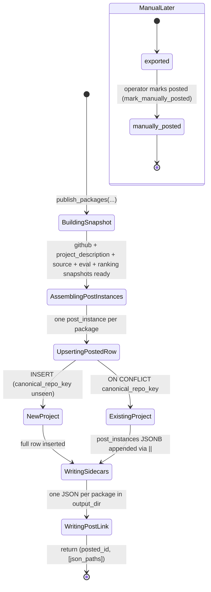
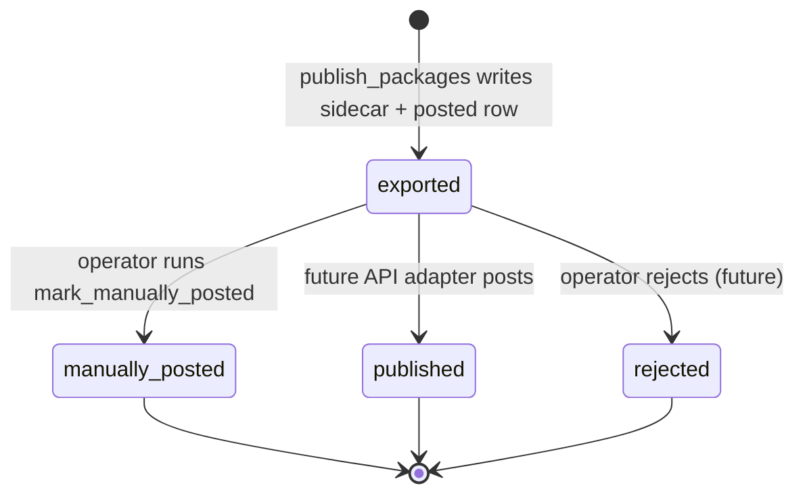

# Publishing

> *"Make the post real, then make it copy-pasteable."*

## Purpose

Publishing is the final stop in the pipeline. It takes one or more `PostPackage`s for a single winning candidate and turns them into:

1. A persistent record in `posted_repositories` — the canonical archive of what RepoRadar has produced.
2. One JSON sidecar per channel written next to the rendered image — the artifact the operator copy-pastes when manually posting.
3. A `post_link` back-reference written onto the candidate row.

The default flow is **manual export**: nothing is auto-posted to LinkedIn or Instagram. The service is designed to make adding an API publisher later straightforward without changing the rest of the pipeline.

## Source layout

```
src/publishing/
├── __init__.py
├── service.py                    # Top-level: publish_packages
├── repository.py                 # Owns posted_repositories table
└── adapters/
    └── manual_export.py          # default: JSON sidecar to output_dir
```

`adapters/` is where future API publishers will live (`linkedin_api.py`, `instagram_graph.py`, `website.py`). The current setup intentionally has only `manual_export.py` to keep the surface area minimal.

## Internal pipeline



Note: `mark_manually_posted` is called separately by the operator (today via direct DB or future dashboard button) — `publish_packages` only takes the channel as far as `exported`.

## Entry points

```python
from src.publishing import publish_packages
from src.publishing.repository import mark_manually_posted
from src.publishing.adapters.manual_export import export_to_disk
```

| Function | Signature | Returns |
|---|---|---|
| `publish_packages` | `(conn, settings, *, candidate, evaluation, selection, packages)` | `(posted_id, [json_paths])` |
| `repository.upsert_posted_repository` | `(conn, *, candidate, evaluation, selection, packages)` | `posted_id` |
| `repository.mark_manually_posted` | `(conn, *, posted_id, channel, external_post_url, operator='operator')` | `None` |
| `adapters.manual_export.export_to_disk` | `(package, output_dir)` | `Path` (json sidecar) |

## How the service works

### `publish_packages` — the workflow

```python
def publish_packages(conn, settings, *, candidate, evaluation, selection, packages):
    posted_id = upsert_posted_repository(...)      # 1. snapshot to DB
    for package in packages:
        json_path = export_to_disk(package, ...)   # 2. write sidecar per channel
    set_post_link(conn, candidate_id=..., ...)     # 3. back-fill candidate row
    return posted_id, [json_paths]
```

Three steps, in order:

1. **Snapshot the project into `posted_repositories`.** This is where a candidate stops being "ephemeral work-in-progress" and becomes a permanent historical record. The snapshot copies the GitHub metadata, evaluation, ranking, and one `post_instances[]` entry per channel — not a reference, a copy, so months later you can still see what was posted even if the candidate row is archived or the README has changed.

2. **Write per-channel sidecars.** Each `PostPackage` becomes a JSON file in `settings.output_dir`. The file contains the full caption text, hashtags, source links, alt text, and the local path of the rendered image. This is the artifact the operator opens when posting manually.

3. **Back-fill `post_link` on the candidate row.** Closes the loop: the dashboard can now join `candidate_repository_evaluations.post_link.posted_project_id` → `posted_repositories.id` and show "this candidate became these posts".

### `posted_repositories` document shape

Per v2 design §4. One row per canonical project. Snapshots are JSONB columns:

| Column | Source |
|---|---|
| `id` | deterministic: `posted_<project_id>` |
| `project_id`, `canonical_repo_key`, `canonical_repo_url` | from the candidate |
| `github` / `hackathon` | full snapshot from the candidate's enrichment |
| `project_description` | AI summary + why_interesting + audience + tags |
| `source` | original_source_type + discovery_run_id + candidate_id + evaluation_id + selection_id |
| `evaluation_snapshot` | full `Evaluation` payload at time of selection |
| `ranking_snapshot` | ranking_version + score + rank + total_candidates + reasons |
| `post_instances` | JSONB array, one entry per channel (see below) |
| `posting_state` | has_been_posted, posted_platforms, exported_platforms, do_not_repost |
| `audit` | created_at, schema_version, created_by |

A single `post_instance` element:

```json
{
  "post_id": "post_linkedin_8f2a91d3",
  "platform": "linkedin",
  "status": "exported",
  "content": { ... full GeneratedContent ... },
  "media": [ { ... full MediaAsset ... } ],
  "source_links": ["..."],
  "review": {"approved_by": null, "approved_at": null, "review_notes": null},
  "publication": {
    "publishing_mode": "manual",
    "posted_by": null, "posted_at": null,
    "external_post_url": null, "external_post_id": null
  }
}
```

### Idempotency

`upsert_posted_repository` uses `ON CONFLICT (canonical_repo_key) DO UPDATE`. If the same canonical project is selected in a future run (operator override, repost policy change), the row is updated rather than duplicated. The crucial detail is the post_instances append:

```sql
post_instances = posted_repositories.post_instances || EXCLUDED.post_instances
```

The `||` is the JSONB array concatenation operator — new channel posts are appended rather than replacing the prior history. That preserves every post the project has ever generated.

### Manual posting → `mark_manually_posted`

When the operator actually posts (today: by hand, future: dashboard button), `mark_manually_posted(conn, posted_id=..., channel=..., external_post_url=..., operator=...)` does two atomic JSONB updates:

1. Find the matching element in `post_instances` (by `platform == channel`), set its `status` to `manually_posted`, fill in `publication.posted_at` / `external_post_url` / `posted_by`.
2. Update top-level `posting_state.has_been_posted = true`, `last_posted_at = NOW()`, and `first_posted_at = NOW()` only if it was previously null.

All done in pure SQL via `jsonb_set` + `jsonb_build_object` + `jsonb_agg` over `jsonb_array_elements` — no read-modify-write race.

### Manual export adapter

`adapters/manual_export.py::export_to_disk(package, output_dir) -> Path`:

```
output/
└── <channel>_<post_id>_<timestamp>.json    # full PostPackage as JSON
└── <channel>_<stem>_<timestamp>.jpg        # written earlier by media stage
```

The JSON includes the rendered caption text, hashtags, source links, alt text, and the local image path — everything the operator needs in one file.

## Data ownership

Publishing is the **only** writer of `posted_repositories`. It is also the only service permitted to write the `post_link` JSONB section on a `candidate_repository_evaluations` row (the narrow exception to Candidate Intelligence's table-level ownership).

| Table / column | Operation | When |
|---|---|---|
| `posted_repositories.*` | INSERT / UPDATE | `publish_packages` |
| `posted_repositories.post_instances[].status` | UPDATE via JSONB | `mark_manually_posted` |
| `posted_repositories.posting_state` | UPDATE | `mark_manually_posted` |
| `candidate_repository_evaluations.post_link` | UPDATE | end of `publish_packages` |

Read access:
- `operator_api.web.queries.get_recent_posts` reads `posted_repositories` to populate the dashboard.
- `candidate_intelligence.repository.already_posted_keys` reads `posted_repositories.canonical_repo_key` to compute the dedup set for discovery.

## How other services interact

| Caller | What it calls | Why |
|---|---|---|
| `orchestrator.pipeline.run_pipeline` | `publish_packages` | Final stage of the daily workflow |
| Operator (future dashboard) | `mark_manually_posted` | Mark a channel as posted after copy-pasting |
| `candidate_intelligence.repository.already_posted_keys` | reads `posted_repositories.canonical_repo_key` | Filters future discovery |
| `operator_api.web.queries.get_recent_posts` | reads `posted_repositories` | Dashboard rendering |

Publishing itself does not call any other service — it's the terminal node of the pipeline.

## Post lifecycle (per channel)



States the schema allows but Publishing does not transition to today: `drafted`, `ready_for_review` (set by Content Generation), `regenerate_requested`, `approved`, `failed`, `archived`. Adding the dashboard's approve/reject buttons will fill those in.

## Configuration knobs

From `Settings`:

| Setting | Default | Effect |
|---|---|---|
| `output_dir` | `output/` | Where sidecar JSONs are written |
| `database_url` | (required) | Supabase Postgres connection string |

The publishing service has no other tunables — its behavior is deterministic given the inputs.

## Failure handling

- **Sidecar write fails:** raises through to the orchestrator, which marks the run failed. The DB upsert may have already succeeded — the next attempt with the same `canonical_repo_key` will be a no-op append because of the `ON CONFLICT` clause.
- **DB upsert fails:** raises immediately, no sidecar gets written.
- **Partial channel publish:** if one channel's sidecar write fails after another's succeeded, the run is marked failed but the operator can still see exported sidecars in `output/`. The DB row has both channels in `post_instances` so resuming is straightforward.

## Out of scope today

- **API publishing adapters.** `adapters/linkedin_api.py`, `adapters/instagram_graph.py`, `adapters/website.py` are not implemented. To add one: create the file under `adapters/`, branch on a `publishing_mode` setting in `service.py`, and update the post_instance's `publication.publishing_mode` accordingly.
- **Dashboard approve/reject endpoints.** `mark_manually_posted` is the only post-publish mutation available today, and it must be called programmatically. v2 §5 describes the full approve / reject / regenerate / mark-posted flow.
- **Repost policy.** `posting_state.do_not_repost` is always set to `true` and read by `candidate_intelligence.source_adapters` via `already_posted_keys`. There's no manual override yet.
- **Cost accounting.** Per-post LLM + image API spend is logged to `api_calls` by the AI Gateway but not summarized per `posted_id`.
