# Scheduler

> *"Fire the daily run. Don't think about what the run does."*

## Purpose

The Scheduler is RepoRadar's cron. Once a day at a configured hour (with jitter, so the post time is unpredictable), it invokes `orchestrator.run_pipeline`. Per v2 §2.2 it owns *only* cron-like behavior — it does not know what discovery, evaluation, content generation, or publishing do.

## Source layout

```
src/scheduler/
├── __init__.py
└── daemon.py        # APScheduler BlockingScheduler + cron trigger + jitter sleep
```

Two files, ~80 lines total. The entire service is a long-running Python process whose job is *"wake up, sleep a random amount, call run_pipeline, go back to sleep"*.

## Workflow

```mermaid
stateDiagram-v2
    [*] --> Idle : run_forever(settings)
    Idle --> Registering : build_scheduler() configures BlockingScheduler
    Registering --> WaitingForCron : cron registered at (SCHEDULE_HOUR − jitter):00
    WaitingForCron --> CronFired : trigger hits

    CronFired --> Jittering : compute random [0, 2·jitter] minutes
    Jittering --> InvokingOrchestrator : sleep complete
    InvokingOrchestrator --> RunSucceeded : orchestrator returned (or returned None)
    InvokingOrchestrator --> RunFailed : orchestrator raised

    RunSucceeded --> WaitingForCron : daemon keeps running
    RunFailed --> WaitingForCron : exception logged; daemon stays alive

    WaitingForCron --> ShuttingDown : SIGINT / SIGTERM
    ShuttingDown --> [*]
```



The Scheduler **never exits on a failed run**. A daily failure is logged and the daemon goes back to waiting. The next day's cron tick is independent.

## Entry points

```python
from src.scheduler import build_scheduler, run_forever
```

| Function | Purpose | Returns |
|---|---|---|
| `run_forever(settings)` | Build the scheduler, install signal handlers, block on `sched.start()` | Never (blocks until SIGTERM) |
| `build_scheduler(settings)` | Construct + configure the APScheduler `BlockingScheduler` without starting it (useful for tests / inspection) | `BlockingScheduler` |
| `_content_job(settings)` | Private — the actual job body that the cron fires | `None` |

## How it works

### Cron offset + jitter window

```python
def _cron_offset(schedule_hour: int, jitter_minutes: int) -> tuple[int, int]:
    total = schedule_hour * 60 - jitter_minutes
    return (total // 60) % 24, total % 60
```

If `SCHEDULE_HOUR=6` and `SCHEDULE_JITTER_MINUTES=15`, the cron fires at **05:45** (i.e. `jitter_minutes` early). The job then sleeps a random `[0, 2·jitter]` minutes — so the effective run time falls uniformly in **[05:45, 06:15]** every day.

That uniform window matters because the post time becomes unpredictable from outside (relevant for not-appearing-bot-like) without losing the daily cadence.

### `_content_job` — what one tick does

```python
def _content_job(settings):
    delay_minutes = random.randint(0, 2 * settings.schedule_jitter_minutes)
    if delay_minutes:
        time.sleep(delay_minutes * 60)

    with connect(settings) as conn:
        try:
            run_pipeline(conn, settings, requested_by="scheduler")
        except Exception as exc:
            _log.exception("Pipeline run raised: %s", exc)
```

- Opens a fresh Postgres connection for the run, closes it when done. Each daily run is its own connection — no long-lived shared state.
- Marks the run as `requested_by="scheduler"` so the dashboard can distinguish scheduled vs manual runs.
- Catches everything and logs. The exception never escapes the job, so the next day's cron still fires.

### `build_scheduler`

```python
def build_scheduler(settings):
    sched = BlockingScheduler(timezone=settings.timezone_name)
    cron_hour, cron_minute = _cron_offset(settings.schedule_hour, settings.schedule_jitter_minutes)
    sched.add_job(
        _content_job,
        CronTrigger(hour=cron_hour, minute=cron_minute, timezone=settings.timezone_name),
        args=[settings],
        id="content",
        name="Daily content pipeline",
        max_instances=1,        # ensure overlapping runs cannot happen
        coalesce=True,          # if cron missed (e.g., daemon was down), fire once on resume
    )
    return sched
```

Two APScheduler options matter:

- **`max_instances=1`** — if for some reason today's run is still running when tomorrow's cron fires, the second is skipped. There is never more than one pipeline executing.
- **`coalesce=True`** — if the daemon was down across multiple cron ticks, APScheduler "coalesces" them into a single missed-trigger fire on startup. You get one catch-up run, not N.

### `run_forever` — production entry

```python
def run_forever(settings):
    sched = build_scheduler(settings)

    def _shutdown(signum, frame):
        sched.shutdown(wait=False)

    signal.signal(signal.SIGINT, _shutdown)
    signal.signal(signal.SIGTERM, _shutdown)
    sched.start()      # blocks
```

`sched.start()` blocks the calling thread. SIGINT (Ctrl+C) or SIGTERM (container stop) triggers a non-waiting shutdown — the scheduler stops accepting new jobs but does not interrupt an in-flight job mid-pipeline.

## Data ownership

The Scheduler owns **nothing** in the database. It does not even open a Postgres connection outside of the orchestrator call window. All state belongs to the orchestrator (`pipeline_runs`) and the downstream services.

## How it's invoked

```bash
python -m src daemon
```

That's it. The CLI command (`operator_api.cli.cmd_daemon`) just calls `run_forever(settings)` and blocks until the process is killed. In production this is a single long-running process — typically run under systemd, supervisord, Docker, or `nohup`.

## Cross-service interactions

| Direction | Counterparty | What |
|---|---|---|
| Scheduler → Orchestrator | `orchestrator.run_pipeline` | Daily fire |
| (none) → Scheduler | — | Nothing calls into the scheduler — it's a self-driven daemon |

The Scheduler is a leaf node on the "what initiates work" graph. The only other initiator is the Operator API CLI.

## Configuration knobs

From `Settings`:

| Setting | Default | Effect |
|---|---|---|
| `schedule_hour` | `6` | Target hour for the daily post (local timezone) |
| `schedule_jitter_minutes` | `15` | ± window in minutes around `schedule_hour` |
| `timezone_name` | `"UTC"` | IANA TZ name (e.g. `"America/New_York"`) |

Changing these requires restarting the daemon — they're read at scheduler-construction time, not per-tick.

## Failure modes

| Symptom | Cause | Effect |
|---|---|---|
| Daemon dies | Unhandled exception in `run_forever` setup | Process exits; needs supervisord/systemd restart |
| Pipeline raises | Discovery, evaluation, or publishing error | Caught in `_content_job`, logged, daemon stays alive |
| Cron missed while daemon down | Process was stopped during the cron window | `coalesce=True` fires one catch-up run on startup |
| Two cron ticks overlap | Pipeline ran > 24h | `max_instances=1` skips the second tick |
| Random sleep interrupted | SIGTERM during jitter wait | Job's exception is caught; daemon shuts down cleanly via signal handler |

## Out of scope today

- **Multiple daily fires.** Only one cron job is registered. Multi-fire support would mean registering N triggers, or moving to a more general "scheduling config" table.
- **Per-channel schedules.** "Post Instagram at 9am, LinkedIn at 5pm" requires invoking the orchestrator with `channels=` per trigger.
- **External triggers** (webhooks, "post now" buttons). Today the only manual entry is the CLI `run` command.
- **Backfill runs over historical windows.** v2 §2.2 mentions it; not implemented.
- **Distributed scheduling.** A second daemon process would double-fire — APScheduler's `max_instances=1` is per-process. Running multiple daemons requires a JobStore backend (e.g. Postgres) which we haven't added.
